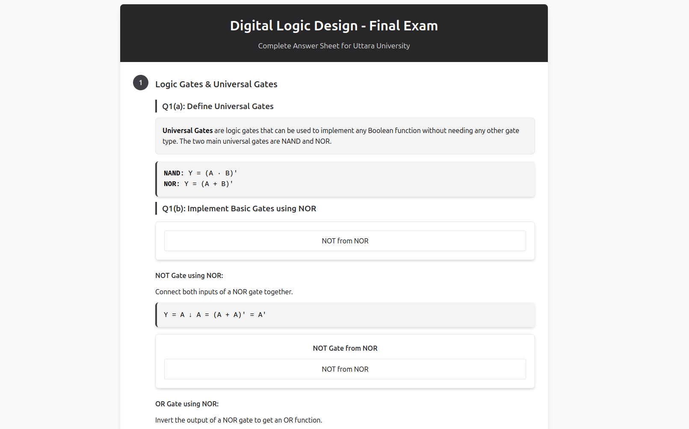

# 📚 Digital Logic Design - Final Exam Q&A

[](https://www.w3.org/html/)
[](https://opensource.org/licenses/MIT)

A comprehensive, exam-ready Q&A sheet designed to help BSc CSE students ace their Digital Logic Design final exam. This repository contains a single, self-contained HTML file that distills all important concepts from course materials into an easy-to-navigate study guide.

## ✨ Key Features

- ✅ **Comprehensive Coverage**: Covers all major topics from the DLD syllabus, including Logic Gates, K-Maps, Adders, and Multiplexers.
- ✅ **Exam-Focused Format**: Questions are structured with mark allocations, mirroring a real exam paper.
- ✅ **Clean & Responsive Design**: A visually appealing, mobile-friendly interface that makes studying less of a chore.
- ✅ **Easy to Remember**: Answers are concise, supplemented with diagrams and truth tables for better retention.
- ✅ **Single File Solution**: No complex setup. Just download and open the HTML file in any web browser.
- ✅ **Open Source**: Free to use, modify, and distribute under the MIT License.

## 📖 Topics Covered

1.  **Logic Gates & Universal Gates**
    -   Definition and Implementation of Universal Gates (NAND, NOR)
    -   Basic Gates using Universal Gates
    -   Truth Tables and Circuit Diagrams

2.  **Karnaugh Maps (K-Maps)**
    -   2-Variable and 3-Variable K-Map Simplification
    -   Grouping Techniques
    -   Boolean Expression Minimization

3.  **Adders and Subtractors**
    -   Half Adder and Full Adder
    -   Implementation using Different Logic Gates
    -   Half Subtractor and Full Subtractor
    -   Circuit Diagrams and Boolean Expressions

4.  **Encoders and Decoders**
    -   Definition and Functionality
    -   Comparison between Encoders and Decoders
    -   Practical Applications

5.  **Multiplexers (MUX) and Demultiplexers (DEMUX)**
    -   Working Principles
    -   Circuit Implementations
    -   Applications in Digital Systems

## 🚀 How to Use

Getting started is simple. Follow these steps to access your study guide:

1.  **Clone the Repository**:
    ```bash
    git clone https://github.com/awebcode/digital-logic-design-suggessions.git
    ```

2.  **Navigate to the Directory**:
    ```bash
    cd digital-logic-design-suggessions
    ```

3.  **Open the HTML File**:
    -   **On macOS**: `open index.html`
    -   **On Linux**: `xdg-open index.html`
    -   **On Windows**: Simply double-click the `index.html` file.

The study guide will open in your default web browser, ready for you to begin your revision!

## 📸 Screenshot



## 🤝 Contributing

Contributions are what make the open-source community such an amazing place to learn, inspire, and create. Any contributions you make are **greatly appreciated**.

If you have a suggestion that would make this better, please fork the repo and create a pull request. You can also simply open an issue with the tag "enhancement".

1.  Fork the Project
2.  Create your Feature Branch (`git checkout -b feature/AmazingFeature`)
3.  Commit your Changes (`git commit -m 'Add some AmazingFeature'`)
4.  Push to the Branch (`git push origin feature/AmazingFeature`)
5.  Open a Pull Request

## ⚠️ Disclaimer

This material is intended for educational purposes as a supplement to official course materials. While every effort has been made to ensure the accuracy of the information, students should verify the content against their official syllabus and textbooks. The creators are not responsible for any discrepancies or outcomes from its use.

## 📜 License

Distributed under the MIT License. See `LICENSE` for more information.

## 👨‍💻 Created with ❤️ by [Asikur Rahman](https://github.com/awebcode)

---

**Live Demo**: [https://awebcode.github.io/digital-logic-design-suggessions/](https://awebcode.github.io/digital-logic-design-suggessions/)
